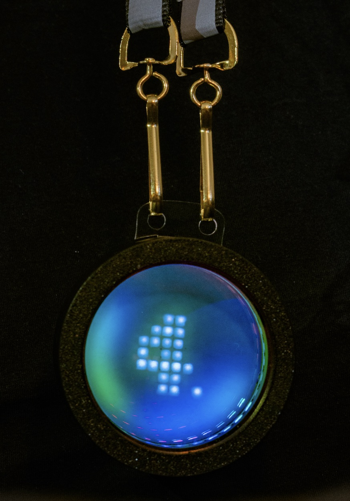
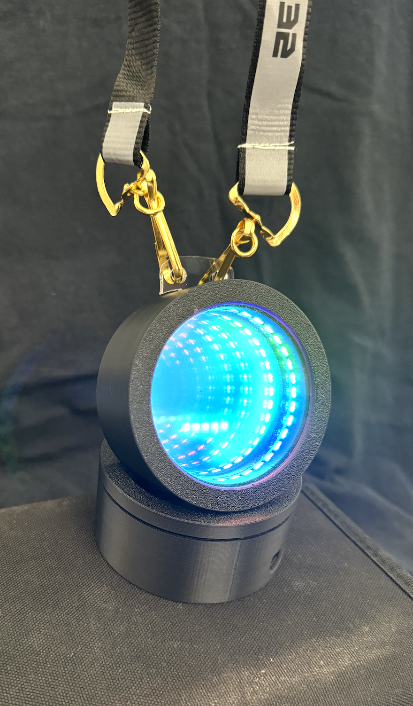
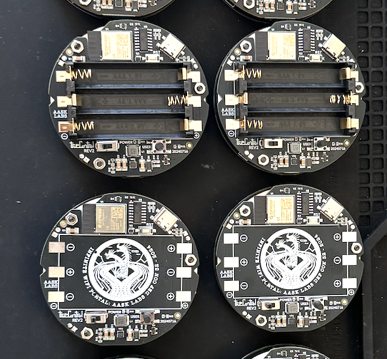
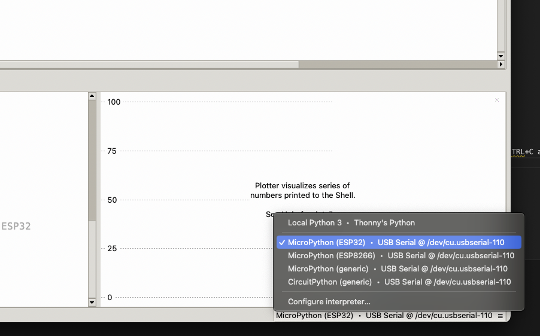

# DC32_Infinite_Wifi_Portal

**Made for:** DEF CON 32  
**Concept & Code by:** [Aask](https://aask.ltd)  
**Hardware by:** [True](https://truecontrol.org)  

Welcome to the fifth iteration of this [Infinity Mirror series](aask.ltd/ftc_fancy_lights) of products that I'm apparently making regularly now! For DEF CON 32 I thought I'd spice things up a bit with a hand-held medallion that peers into the infinite, ticks as a clock, and looks freaking sweet. We even sprung for the Retro-Reflective lanyards!  

As you explore this hardware, note that there are LOTS of hardware features that have yet to have their full potential realized, this product is as pretty as it is useful as a learning tool for diving head-first in to Embedded systems engineering and firmware design. I've rewritten the code several times to make it easy to follow and understand. If you find and resolve a bug, reach out so we can merge your PR!   

</img>

</br>


## Getting Started

- The device will take 2-5 seconds to boot  
- Once up it will tick at the default BPM of 60  
- The current number of visible Wifi Networks is the length of the outer ring of LEDs.  

If you turn the device so the face points towards the earth, it will auto-dim and auto-power off the LED control chips onboard, and will automatically turn back on when tilted upright. 

There IS a button on the back. It's up to YOU to learn how to program a button handler and make it do something neat! Or we will have a set of features implemented on it for Hackaday SuperCon. 

### How do I mess with the code?

To make editing the code easier, we have made the silly decision to use Micropython. Why MicroPython instead of Arduino C, or CircuitPython, or other languages? Well...Because in the original [aask.ltd/ftc_fancy_lights](aask.ltd/ftc_fancy_lights) we were tasked with using MicroPython, and I figured it worked then so my students could edit and learn on the fly, why not use it for this DEF CON badge and make it easy for the badge-owners to edit their own code. 

### How do I change how fast it goes?

- To change the speed of the outside ticking ring you can manually plug the device into Thonny and update the default ```bpm``` value in the ```main()``` loop at the bottom of ```main.py```. . 
  - TODO: Move this BPM to a new config file

### How do I change the BANNER?

- To change the scrolling text you can manually plug the device into Thonny and update the default ```matrix_manager.scroll_text_frames()``` value in the ```main()``` loop at the bottom of ```main.py```. 
  - TODO: Move the default text to a CONFIG file

### How do I change how fast it goes  or change the banner without always having to plug it in?

For now, you will need to use the application Thonny to connect to the badge and configure your WIFI and your MQTT. 

- To control over the internet, you will need to:
  - Configure ```CONFIG/WIFI_CONFIG.py```. Add your desired networks and passwords to this list.
  - Configure an MQTT Broker in the ```CONFIG/WIFI_CONFIG.py``` file with the appropriate credentials your MQTT broker. 
    - We are working on secure MQTT on the ESP32 but we are pushing this little chip a little far for the moment. Will update with secure MQTT using certificates later this year (2024).
  - **NOTE:** If you don't already have an MQTT broker, [hiveMQ.com](hivemq.com) is free for personal use. It's easy to set up, and it's decently fast. 
  - There are many other options for broker, it's up to you to decide!
- Once you have MQTT set up and your badge connecting
  - Set up MQTT Spy (or your app of choice) to publish to ```bpm``` as the topic, and send it the BPM you wish to set. 
  - Publish

### How do I change the number of LEDs active on the outer ring?

Modify the ```main.py``` 

- TODO: Move this to LED_CONFIG.py. Also note that if on DEF CON firmware this is changed. 

## Flashing Instructions

### Step 1

- You MUST flash our CUSTOM version of MicroPython to your device. There is a ```auto_flash.sh``` file available to auto-flash Micropython to your device when you plug in and unplug it for mass flashing of devices. 
  - This version of MPY is included in this repository. If you use the default version of Micropython you will not be able to take advantage of the non-blocking WiFi scanning features
- The custom version of micropython is in the included Zip file in this repository. It MUST be flashed using ESPTool. 

- Command to flash our version of Micropython (to take advantage of smooth wifi-scanning):

```bash
./flash.sh
```

### Step 2

Run ```auto_flash.sh```, make sure to run ```chmod +x ./auto_flash.sh``` so it will run correctly!

NOTE: This will take approx 2-4 minutes as the Micropython REPL is slow. But it'll be worth it as you can edit files directly in Thonny when this is done. 

### Step 3 (Optional)

Set up the Wifi and MQTT connections. NOTE: If you did NOT get your badge at DEF CON, you will need to program your own MQTT broker for controlling your device


## Thonny Setup Instructions

This ESP32 has some settings different that need to be toggled in order for it to work in Thonny on Windows and Linux. For MacOS it just "works"TM . 


### Windows & Linux & MacOS

For some reason Thonny auto-enables rts/dtr and that needs to be disabled on Windows and on Linux. Here's how to fix it: https://github.com/thonny/thonny/issues/2797#issuecomment-1569525310 

### Connecting to the device

Plug in, start ```Thonny```, click the bottom right and select your SERIAL PORT device. In Unix like systems it will be ```/dev/tty.usbserial###``` on Windows it will say ```COM##```. If your DTR/RTS settings are correct, you may have to hit CTRL+C and end the running program to connect and browse the filesystem on the device. 

ProTip: In ```Thonny``` go to ```View->Files``` to view the filesystem on your badge. Ensure you create a LOCAL BACKUP of your files before editing them. 



## Firmware Onboard

Mostly-standard MicroPython with the upgraded feature of NON-BLOCKING Scanning. You heard that RIGHT folks. The Wifi Scan function has been distilled down to it's quickest in this iteration of MicroPython. 

## Hardware Onboard

- ESP32-N1-Mini
  - Runs anything not mentioned below
- IS31FL3729
  - Physical LED matrix driver
  - Upfiring LEDs
  - Matrix is configured in a 3x15 grid. 
    - There are 42 White LEDs
    - There is ONE Green LED
    - There is ONE Red LED
  - Custom driver written for DEF CON 32
- LIS2DW12
  - Accelerometer
  - Driver: https://github.com/micropython-Chinese-Community/mpy-lib/blob/master/sensor/LIS2DW12/LIS2DW12.py
- LTR_308ALS
  - Light Sensor
  - Driver: https://github.com/void3729/Mixly2.0_hyseim/blob/f12550ce6cbb8b6bc311a2740abcfe258b31dc13/resources/app/board/micropython_esp32_mixgope/build/lib/ltr308al.py#L4
- 36 RGB LEDs 
  - Neopixel or other data-pin driven RGB controller of your heart's desire


## Credits

**Made for:** DEF CON 32  
**Concept by:** [Aask](https://aask.ltd)  
**Hardware by:** [True](https://truecontrol.org)  
**Code by:** Aask (with special thanks to my team)  
**Micropython Non-blocking WiFi Scan by:** trwbox  
- Thank you for this much needed patch!  
  - [Fork of MicroPython with the patch for non-blocking WiFi scanning](https://github.com/trwbox/micropython) 

**MQTT by:** DBISU & Aask  
- Thank you for securing the MQTT at DEF CON!  

**Debugging and Code Review by:** Lightning  
- Thank you for solving the RTS/DTR problem! 
- And the Frame Buffer Overload issues!  

**Project Management:** Kiwi

